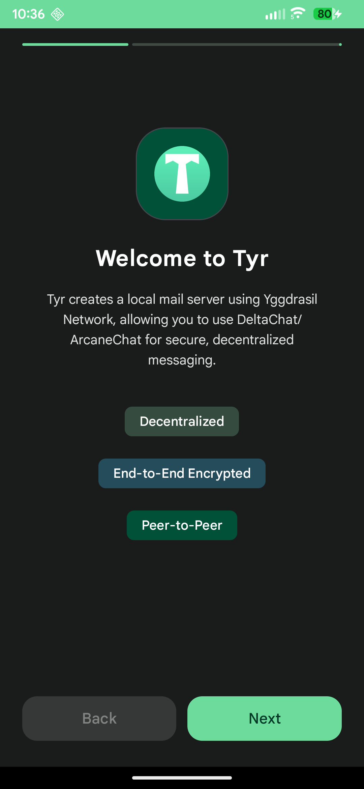
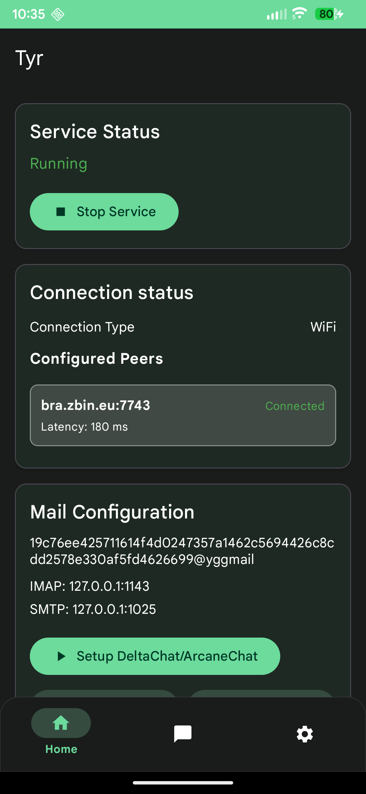
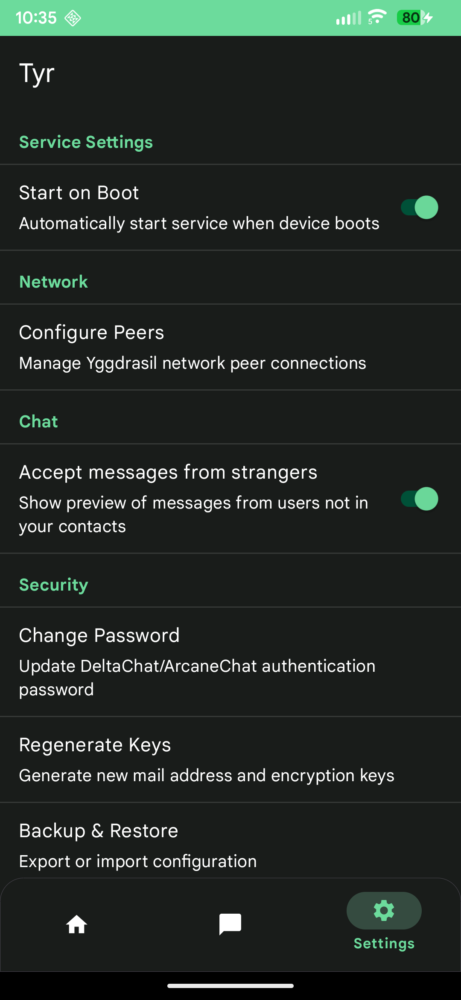
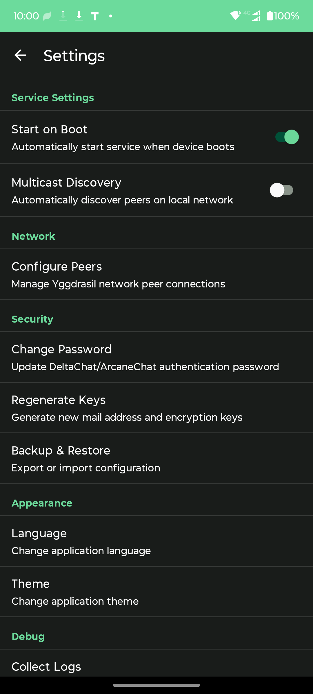
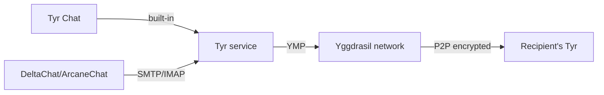

<div align="center">


# Tyr

Peer-to-peer email on the Yggdrasil network.

[](LICENSE)

[](https://kotlinlang.org)


[](https://github.com/JB-SelfCompany/Tyr)


[](https://apt.izzysoft.de/packages/com.jbselfcompany.tyr)

**[English](#) | [Русский](README.ru.md)**

</div>

---

## Screenshots

<div align="center">

| | | | |
| --- | --- | --- | --- |
|  |  |  |  |

</div>

---

## What is Tyr?

Tyr runs a complete mail server on your Android device and routes mail over the
[Yggdrasil](https://yggdrasil-network.github.io/) mesh network — no central mail
servers, no port forwarding, no STUN/TURN. Messages route directly between nodes,
and Yggdrasil encrypts everything in transit.

Your address is derived from an Ed25519 public key (`<64-hex>@yggmail`), so it
cannot be spoofed. Standard SMTP/IMAP is exposed on localhost, so any mail client
works; DeltaChat/ArcaneChat give the best P2P messaging experience.

## Features

- Built-in P2P chat (text + photos) over Yggdrasil — no third-party app required
- DeltaChat / ArcaneChat auto-configuration
- Works with any SMTP/IMAP client (K-9 Mail, Thunderbird Mobile, FairEmail)
- Local SMTP (`127.0.0.1:1025`) and IMAP (`127.0.0.1:1143`) servers
- Ed25519 cryptographic identity
- Configurable Yggdrasil peers with RTT-based auto-discovery
- Push notifications with Doze-aware battery optimization
- Auto-start on boot
- Password-protected encrypted backup/restore
- Log collection with period selection and archiving

## How it works


```mermaid
graph LR
    A[Tyr Chat] -->|built-in| B[Tyr service]
    C[DeltaChat/ArcaneChat] -->|SMTP/IMAP| B
    B -->|YMP| D[Yggdrasil network]
    D -->|P2P encrypted| E[Recipient's Tyr]
```

The mail server is [yggmail-ng](https://github.com/JB-SelfCompany/Yggmail-ng)
(Rust), embedded as a native library via UniFFI (`libyggmail_mobile.so`) and run
as a foreground service. On top of Yggdrasil it exposes SMTP and IMAP4rev1 on
localhost; any client can connect.

Built-in chat (since 1.8) uses the same encrypted P2P transport: text and photos,
delivery/read receipts, tap-to-copy, auto-read on open, and suppressed
notifications while a conversation is in the foreground.

## Quick start

### DeltaChat / ArcaneChat (recommended)

**Automatic:** complete onboarding (password + peers), start the service, install
[DeltaChat](https://delta.chat/) or [ArcaneChat](https://github.com/ArcaneChat/android),
then tap **Setup DeltaChat/ArcaneChat** — Tyr opens the app pre-configured.

**Manual:** create a new profile → *Use a different server* → enter your `@yggmail`
address (from Tyr's main screen) and the password you set in Tyr.

### Other clients (K-9 Mail, Thunderbird, FairEmail)

- **Email:** your `<64-hex>@yggmail` address
- **Password:** the password set during onboarding
- **IMAP:** `127.0.0.1:1143` (no TLS) · **SMTP:** `127.0.0.1:1025` (no TLS)

Tyr must be running for mail to flow — enable auto-start in settings. Use the **QR
Code** button to share your address.

## Security

- Password stored via Android Keystore (AES-256-GCM), with automatic recovery for
  known Keystore issues on Samsung and other devices
- P2P traffic encrypted by Yggdrasil in transit
- SMTP/IMAP bound to localhost only
- Ed25519 identity — address cannot be spoofed
- Password-protected encrypted backups
- Push without third-party push services or metadata exposure

## Building from source

### Prerequisites

- JDK 17
- Android SDK — Platform 36, build-tools, min API 23 (Android Studio provides these)
- Android SDK/NDK path configured (`local.properties` or `ANDROID_HOME`)

Gradle is provided by the wrapper (`./gradlew`) — no separate install.

### Build

```bash
git clone https://github.com/JB-SelfCompany/Tyr.git
cd Tyr
./gradlew assembleDebug      # debug APK → app/build/outputs/apk/debug/
./gradlew installDebug       # install to a connected device
```

### Rebuilding the native library (optional)

The prebuilt `libyggmail_mobile.so` files live in `app/src/main/jniLibs/<abi>/` and
the UniFFI bindings in `app/src/main/java/uniffi/yggmail_mobile/`. To rebuild them
from [yggmail-ng](https://github.com/JB-SelfCompany/Yggmail-ng) you additionally need:

- Rust (stable) + Android targets:
  `rustup target add aarch64-linux-android armv7-linux-androideabi x86_64-linux-android i686-linux-android`
- `cargo install cargo-ndk`
- Android NDK with `ANDROID_NDK_HOME` set

```bash
cd Yggmail-ng && ./build-android.sh        # then copy the .so + bindings per the script's hint
```

## Technical details

| Component | Details |
|-----------|---------|
| Language | Kotlin 2.2.20 |
| Min / Target / Compile SDK | 23 / 33 / 36 |
| Architecture | Layered (UI → Service → Data) |
| Mail server | yggmail-ng (Rust) via UniFFI (`libyggmail_mobile.so`) |
| Network | Yggdrasil overlay mesh |
| Localization | English, Russian |

## Related projects

- [yggmail-ng](https://github.com/JB-SelfCompany/Yggmail-ng) — the mail server that powers Tyr
- [Yggdrasil Network](https://yggdrasil-network.github.io/) — the mesh network
- [DeltaChat](https://delta.chat/) · [ArcaneChat](https://github.com/ArcaneChat/android) — recommended clients
- [K-9 Mail](https://k9mail.app/) · [Thunderbird Mobile](https://www.thunderbird.net/mobile/) · [FairEmail](https://email.faircode.eu/)
- [Mimir](https://github.com/Revertron/Mimir) — P2P messenger on Yggdrasil (sister project)

## License

App: GPLv3 (see [LICENSE](LICENSE)). The embedded yggmail-ng library is MPL-2.0.
