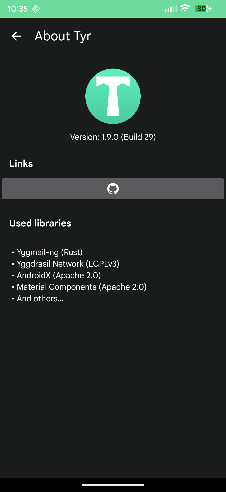
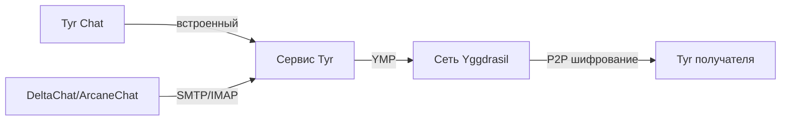

<div align="center">


# Tyr

Одноранговая (P2P) электронная почта в сети Yggdrasil.

[](LICENSE)

[](https://kotlinlang.org)


[](https://github.com/JB-SelfCompany/Tyr)

[](https://apt.izzysoft.de/packages/com.jbselfcompany.tyr)

**[English](README.md) | [Русский](#)**

</div>

---

## Скриншоты

<div align="center">

| | | | |
| --- | --- | --- | --- |
|  |  |  |  |

</div>

---

## Что такое Tyr?

Tyr запускает полноценный почтовый сервер прямо на устройстве Android и
маршрутизирует почту через mesh-сеть [Yggdrasil](https://yggdrasil-network.github.io/) —
без центральных почтовых серверов, проброса портов и STUN/TURN. Сообщения идут
напрямую между узлами, а Yggdrasil шифрует весь трафик в транзите.

Адрес выводится из публичного ключа Ed25519 (`<64-hex>@yggmail`), поэтому его
нельзя подделать. Стандартные SMTP/IMAP доступны на localhost, так что подойдёт
любой почтовый клиент; DeltaChat/ArcaneChat дают лучший P2P-опыт.

## Возможности

- Встроенный P2P-чат (текст + фото) поверх Yggdrasil — сторонние приложения не нужны
- Автонастройка DeltaChat / ArcaneChat
- Работает с любым SMTP/IMAP-клиентом (K-9 Mail, Thunderbird Mobile, FairEmail)
- Локальные серверы SMTP (`127.0.0.1:1025`) и IMAP (`127.0.0.1:1143`)
- Криптографическая личность на Ed25519
- Настраиваемые пиры Yggdrasil с авто-обнаружением по RTT
- Push-уведомления с оптимизацией под Doze
- Автозапуск при загрузке
- Зашифрованное резервное копирование с паролем
- Сбор логов с выбором периода и архивацией

## Как это работает



Почтовый сервер — [yggmail-ng](https://github.com/JB-SelfCompany/Yggmail-ng)
(Rust), встроенный как нативная библиотека через UniFFI (`libyggmail_mobile.so`)
и работающий как foreground-сервис. Поверх Yggdrasil он отдаёт SMTP и IMAP4rev1
на localhost; подключается любой клиент.

Встроенный чат (с 1.8) использует тот же зашифрованный P2P-транспорт: текст и
фото, статусы доставки/прочтения, копирование по нажатию, авто-прочтение при
открытии и подавление уведомлений, пока диалог открыт.

## Быстрый старт

### DeltaChat / ArcaneChat (рекомендуется)

**Автоматически:** пройдите онбординг (пароль + пиры), запустите сервис, установите
[DeltaChat](https://delta.chat/) или [ArcaneChat](https://github.com/ArcaneChat/android),
затем нажмите **Настроить DeltaChat/ArcaneChat** — Tyr откроет приложение с готовыми настройками.

**Вручную:** создайте новый профиль → *Использовать другой сервер* → введите свой
`@yggmail`-адрес (с главного экрана Tyr) и пароль, заданный в Tyr.

### Другие клиенты (K-9 Mail, Thunderbird, FairEmail)

- **Почта:** ваш адрес `<64-hex>@yggmail`
- **Пароль:** заданный при онбординге
- **IMAP:** `127.0.0.1:1143` (без TLS) · **SMTP:** `127.0.0.1:1025` (без TLS)

Для передачи почты Tyr должен быть запущен — включите автозапуск в настройках.
Кнопка **QR-код** делится вашим адресом.

## Безопасность

- Пароль хранится через Android Keystore (AES-256-GCM), с авто-восстановлением при
  известных проблемах Keystore на Samsung и других устройствах
- P2P-трафик шифруется Yggdrasil в транзите
- SMTP/IMAP слушают только localhost
- Личность на Ed25519 — адрес нельзя подделать
- Зашифрованные бэкапы под паролем
- Push без сторонних push-сервисов и утечки метаданных

## Сборка из исходников

### Требования

- JDK 17
- Android SDK — Platform 36, build-tools, минимум API 23 (входят в Android Studio)
- Путь к Android SDK/NDK настроен (`local.properties` или `ANDROID_HOME`)

Gradle предоставляется врапером (`./gradlew`) — отдельная установка не нужна.

### Сборка

```bash
git clone https://github.com/JB-SelfCompany/Tyr.git
cd Tyr
./gradlew assembleDebug      # debug APK → app/build/outputs/apk/debug/
./gradlew installDebug       # установка на подключённое устройство
```

### Пересборка нативной библиотеки (опционально)

Готовые `libyggmail_mobile.so` лежат в `app/src/main/jniLibs/<abi>/`, а UniFFI-биндинги —
в `app/src/main/java/uniffi/yggmail_mobile/`. Чтобы пересобрать их из
[yggmail-ng](https://github.com/JB-SelfCompany/Yggmail-ng), дополнительно нужны:

- Rust (stable) + Android-таргеты:
  `rustup target add aarch64-linux-android armv7-linux-androideabi x86_64-linux-android i686-linux-android`
- `cargo install cargo-ndk`
- Android NDK с заданной `ANDROID_NDK_HOME`

```bash
cd Yggmail-ng && ./build-android.sh        # затем скопируйте .so + биндинги по подсказке скрипта
```

## Технические детали

| Компонент | Детали |
|-----------|--------|
| Язык | Kotlin 2.2.20 |
| Min / Target / Compile SDK | 23 / 33 / 36 |
| Архитектура | Слоистая (UI → Service → Data) |
| Почтовый сервер | yggmail-ng (Rust) через UniFFI (`libyggmail_mobile.so`) |
| Сеть | Оверлейная mesh-сеть Yggdrasil |
| Локализация | Английский, русский |

## Связанные проекты

- [yggmail-ng](https://github.com/JB-SelfCompany/Yggmail-ng) — почтовый сервер, на котором работает Tyr
- [Yggdrasil Network](https://yggdrasil-network.github.io/) — mesh-сеть
- [DeltaChat](https://delta.chat/) · [ArcaneChat](https://github.com/ArcaneChat/android) — рекомендуемые клиенты
- [K-9 Mail](https://k9mail.app/) · [Thunderbird Mobile](https://www.thunderbird.net/mobile/) · [FairEmail](https://email.faircode.eu/)
- [Mimir](https://github.com/Revertron/Mimir) — P2P-мессенджер на Yggdrasil (родственный проект)

## Лицензия

Приложение: GPLv3 (см. [LICENSE](LICENSE)). Встроенная библиотека yggmail-ng — MPL-2.0.
